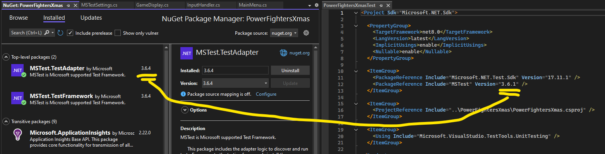
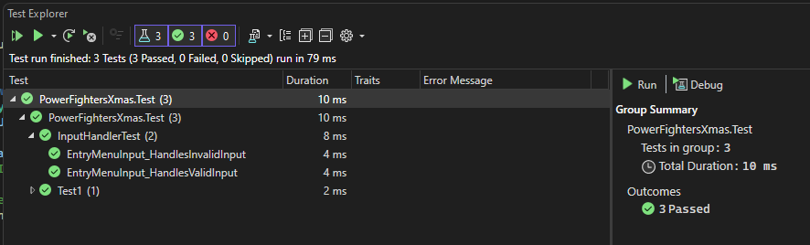
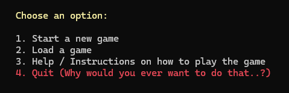
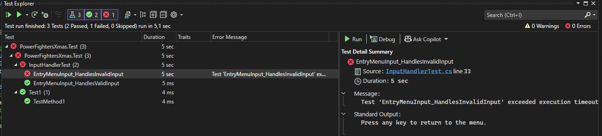

#### Dokumementation av julspel

### Niklas Häll - CLO24 - Power Fighters julen 2024

## Steg för steg-testning av menyn

1. Installerar MS Test genom kommandon:
- dotnet add package MSTest.TestFramework
- dotnet add package MSTest.TestAdapter

2. Högerklickar solutionen i Visual Studio 2022 och väljer "add > new project". Väljer MSTest och skapar ett nytt testprojekt i vanliga testfoldern.

3. Högerklickar testprojektet, väljer "add > project reference" och lägger till en referens i huvudprojektet

4. Dags att skapa en mock (fejkad testdata). Fick omedelbart ett problem:

- Vi har troligtvis installerat en äldre version initialt, så property reflekterar det, sedan har vi uppgraderat till en nyare version så jag ändrar bara versionsnamnet i Properties!

5. 

### When it works it works



Efter mycket testande, framförallt med problem med Console.ReadKey och Console.Clear så löste jag det med en kombination av interfaces och mockups.  
Den korta versionen är att jag skapade en mockklass (MockUserInput) för att hantera mocks, och sedan gjorde jag interfaces för att hantera tester där jag hade metoder i switchmenyer.

### Problematik som uppstått i samband med testning

1. Jag hade kodat en switch-meny som Amir skulle testa. Menyn hade färger för att bli lite roligare och tydligare:
```cs
var entryMenuInput = _userInput.GetInput();
switch (entryMenuInput)
{
    case "1":
        MainMenu.StartNewGame();
        break;
    case "2":
        MainMenu.LoadGame();
        break;
    case "3":
        MainMenu.Instructions();
        break;
    case "4":
        GameDisplay.DisplayColourMessage("\n\tGoodbye! Evil Mage Marcus will come and haunt you forever!", ConsoleColor.Red);
        break;
    default:
        GameDisplay.DisplayColourMessage("Invalid input. Please try again.", ConsoleColor.Red);
        Console.WriteLine("Press any key to return to the menu.");
        Console.ReadKey();
        MainMenu.EntryMenu(false);
        break;
}
```
Tanken var att det skulle se lite roligare och tydligare ut, så här ungefär:

Det blir ett problem med testningen då bara. Vi har en metod i menyn som testas, Amir pekade på att det var svårt för honom att testa och jag insåg att det inte är optimalt med en metod som skall returnera ett värde inuti en meny som redan testas! Lösningen på detta var att skapa ett interface för utmatningen, som jag gjorde med IUserInput för inmatningen. Hela testningen blir lättare med interfacen på plats, vi får en naturlig separation av concerns.

2. Jag fick problem vid testningen av val 4 i menyn, avsluta spelet: det tar input 4 och sedan stängs spelet direkt. Så jag valde att testa att texten som skrivs ut matchar.
```cs
        public void EntryMenuInput_HandlesValidInput()
        {
            // Arrange
            var mockUserInput = new MockUserInput(new[] { "4" });
            var mockGameDisplay = new MockGameDisplay();
            var inputHandler = new InputHandler(mockUserInput, mockGameDisplay);
            // Act
            inputHandler.EntryMenuInput();
            // Debug: Skriv ut alla meddelanden
            Console.WriteLine(string.Join(", ", mockGameDisplay.Messages));
            // Assert
            // We can't really test the output of the EntryMenuInput method, but we can test that it doesn't throw an exception
            Assert.IsTrue(mockGameDisplay.Messages.Contains("Goodbye! Evil Mage Marcus will come and haunt you forever!"));
```
Felet är att jag kör formatteringen \n\t för att göra texten snyggare, testen tar de som empty space, så jag korrigerade det till att testa en del av strängen istället för hela (bytte .Contains mot .Any).
```cs
                                case "4":
                        _gameDisplay.DisplayColourMessage("\n\tGoodbye! Evil Mage Marcus will come and haunt you forever!", ConsoleColor.Red);
                        isValidInput = true;
                        break;
```

3. Console.ReadKey() och Infinite loop.

- Problem: När input är ogiltigt körs default-blocket i switch-menyn. Om en användare sitter vid datorn vill vi ha det beteendet för att vänta på användarens input, men i tester är input automatiserat så då måste vi täcka upp för det.
- Lösning: Ta bort beroendet av Console.ReadKey() genom mockning.
```cs
    public interface IUserInput
    {
        string? GetInput();
        void WaitForKeyPress(); // Added method to mock Console.ReadKey() during testing
    }

    // Then in the MockUserInput class we add this method:
        public void WaitForKeyPress()
    {
        / Do nothing in the tests, to simulate Console.ReadKey()
    }
```

4. Ytterligare ett problem jag hade var att Console.ReadKey och Console.Clear inte fungerar i enhetstester eftersom de körs i en konsolmiljö som inte kan simuleras i testmiljöer. För att lösa problemet får man mocka bort de kommandona när testerna körs. Ett exempel på lösning här:
```cs
internal static void EntryMenu(bool clearConsole = true)
{
    if (clearConsole && Console.IsOutputRedirected == false) // Avoid Console.Clear() in tests
    {
        Console.Clear();
    }
```