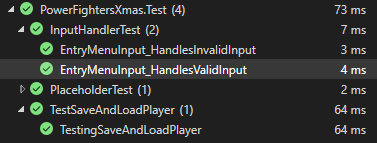

### Niklas Häll - CLO24 - Power Fighters julen 2024
### Dokumentation av julspel

## Steg för steg-testning av menyn

1. Installerar MS Test genom kommandon:
- dotnet add package MSTest.TestFramework
- dotnet add package MSTest.TestAdapter

2. Högerklickar solutionen i Visual Studio 2022 och väljer "add > new project". Väljer MSTest och skapar ett nytt testprojekt i vanliga testfoldern.

3. Högerklickar testprojektet, väljer "add > project reference" och lägger till en referens i huvudprojektet

4. Dags att skapa en mock (fejkad testdata). Fick omedelbart ett problem:

- Vi har troligtvis installerat en äldre version initialt, så property reflekterar det, sedan har vi uppgraderat till en nyare version så jag ändrar bara versionsnamnet i Properties!

5. ..efter det var det ganska straightforward.

## When it works it works


Efter mycket testande, framförallt med problem med Console.ReadKey och Console.Clear så löste jag det med en kombination av interfaces och mockups.  Den korta versionen är att jag skapade en mockklass (MockUserInput) för att hantera mocks, och sedan gjorde jag interfaces för att hantera tester där jag hade metoder i switchmenyer.

## Problematik som uppstått i samband med testning

1. Jag hade kodat en switch-meny som Amir skulle testa. Menyn hade färger för att bli lite roligare och tydligare:
```cs
var entryMenuInput = _userInput.GetInput();
switch (entryMenuInput)
{
    case "1":
        MainMenu.StartNewGame();
        break;
    case "2":
        MainMenu.LoadGame();
        break;
    case "3":
        MainMenu.Instructions();
        break;
    case "4":
        GameDisplay.DisplayColourMessage("\n\tGoodbye! Evil Mage Marcus will come and haunt you forever!", ConsoleColor.Red);
        break;
    default:
        GameDisplay.DisplayColourMessage("Invalid input. Please try again.", ConsoleColor.Red);
        Console.WriteLine("Press any key to return to the menu.");
        Console.ReadKey();
        MainMenu.EntryMenu(false);
        break;
}
```
Tanken var att det skulle se lite roligare och tydligare ut, så här ungefär:..


Det blir ett problem med testningen då bara. Vi har en metod i menyn som testas, Amir pekade på att det var svårt för honom att testa och jag insåg att det inte är optimalt med en metod som skall returnera ett värde inuti en meny som redan testas! Lösningen på detta var att skapa ett interface för utmatningen, som jag gjorde med IUserInput för inmatningen. Hela testningen blir lättare med interfacen på plats, vi får en naturlig separation av concerns.

2. Jag fick problem vid testningen av val 4 i menyn, avsluta spelet: det tar input 4 och sedan stängs spelet direkt. Så jag valde att testa att texten som skrivs ut matchar.
```cs
public void EntryMenuInput_HandlesValidInput()
{
    // Arrange
    var mockUserInput = new MockUserInput(new[] { "4" });
    var mockGameDisplay = new MockGameDisplay();
    var inputHandler = new InputHandler(mockUserInput, mockGameDisplay);
    // Act
    inputHandler.EntryMenuInput();
    // Debug: Skriv ut alla meddelanden
    Console.WriteLine(string.Join(", ", mockGameDisplay.Messages));
    // Assert
    // We can't really test the output of the EntryMenuInput method, but we can test that it doesn't throw an exception
    Assert.IsTrue(mockGameDisplay.Messages.Contains("Goodbye! Evil Mage Marcus will come and haunt you forever!"));
```
Felet är att jag kör formatteringen \n\t för att göra texten snyggare, testen tar de som empty space, så jag korrigerade det till att testa en del av strängen istället för hela (bytte .Contains mot .Any).
```cs
case "4":
    _gameDisplay.DisplayColourMessage("\n\tGoodbye! Evil Mage Marcus will come and haunt you forever!", ConsoleColor.Red);
    isValidInput = true;
break;
```

3. Console.ReadKey() och Infinite loop.

- Problem: När input är ogiltigt körs default-blocket i switch-menyn. Om en användare sitter vid datorn vill vi ha det beteendet för att vänta på användarens input, men i tester är input automatiserat så då måste vi täcka upp för det.
- Lösning: Ta bort beroendet av Console.ReadKey() genom mockning.
```cs
 public interface IUserInput
 {
    string? GetInput();
    void WaitForKeyPress(); // Added method to mock Console.ReadKey() during testing
}

// Then in the MockUserInput class we add this method:
    public void WaitForKeyPress()
{
    // Do nothing in the tests, to simulate Console.ReadKey()
}
```

4. Ytterligare ett problem jag hade var att Console.ReadKey och Console.Clear inte fungerar i enhetstester eftersom de körs i en konsolmiljö som inte kan simuleras i testmiljöer. För att lösa problemet får man mocka bort de kommandona när testerna körs. Ett exempel på lösning här:
```cs
internal static void EntryMenu(bool clearConsole = true)
{
    if (clearConsole && Console.IsOutputRedirected == false) // Avoid Console.Clear() in tests
    {
        Console.Clear();
    }
```

## Testning av UI-filerna

Jag har rollen som UI-makaren, så mina filer är de som ligger i UI-foldern. Jag har tittat igenom vad jag behöver testa:  

- InputHandler.cs har jag visat test på där uppe, det är egentligen bara metoden EntryMenuInput som är aktuell och den testen finns som InputHandlerTest. Det är den viktigaste klassen att testa i UI-filen för den tar emot sträng-input och Console.ReadLine + har potentiella problem med metoder som anropas i menyn, ReadKey-inputs etc. Viktig testfil! 
  
- MainMenu.cs består bara av internal och private-metoder och den tar ingen input, den är en presentation av menyalternativen som InputHandler hanterar, så ingen testning är aktuell.  
  
- GameDisplay.cs är en internal class med två publika metoder under interfacet, och en internal metod utanför interfacet. Det känns väldigt borderline att testa denna, av flera skäl: dels är dess roll primärt visuell, inte funktionell. Dels krävs väldigt mycket arbete att implementera ett Interface + skriva om Console-klassen (och inkludera den i andra filer) bara för att testa två väldigt små metoder som bara byter färg på text. Jag började faktiskt göra detta, men efter att ha skrivit två nya klasser och börjat justera i Console-klassen, då kändes detta inte motiverat bara för att visa att det går att göra..
  
- MapHandler.cs är en internal class med en internal metod, DisplayMap, som egentligen bara tar emot strängen currentRoom för att loopa igenom en lista för att sätta en markör på en ASCII-karta (för att visa var spelaren är). Testning känns inte aktuell, dels internal metod, dels tar den en inmatning som måste vara rätt + sätts i GameState.ShowState (valideras redan i spellogiken!).

#### Med detta sätter jag punkt och lägger ett slutord:

Kul uppgift, lärorikt att få ögonen för vad som kan testas och hur. Kan känna att jag gärna har med testningen i planeringen av programmet, för i mitt fall var mocktester mer optimerat än unittester och då hade jag gärna skapat interfaces direkt istället för att få skriva om kod efterhand - men ur lärosammanhang var det kanon!

#### Tack till mitt team!

Absolut sista ordet vill jag lägga till mitt team:

- Data-Tomten Alireza gjorde ett fantastiskt jobb, han har i samband med att han lägger upp speldatan, byggt upp kartor och hela spelstoryn på en gång! Vi hade aldrig någon som skrev ner en spelide för det löste vår Data-Tomte automatiskt när han genererade objekt. Wow!

- Test-Nissen Amir hade på ett sätt den svåraste uppgiften: inte nog med att han skulle testa alla andras jobb (och därmed var beroende av att vi andra faktiskt slutförde något, med tanke på vår korta deadline), han skulle dessutom skriva tester för första gången. Sjukt imponerad, hans första test skrev han på mycket kort tid, och han gav oss andra grym feedback! Jag hade själv mina metoder i en metod som jag fick en annan bild av tack vare Amir, grymt!

- Spelmotor-Fixaren Hugo skapade precis det vi behövde, en motor som knöt ihop de olika delarna men höll samtidigt ner det till små hanterbara metoder. När vi skulle knyta ihop våra respektive delar gick det oerhört smidigt och vi behövde knappt röra Hugos kod, den var redan komplett! Super!  
  
Vilket team, jag är väldigt imponerad av alla tre, de är riktigt duktiga och jag tror de har väldigt bra förutsättningar att bli värdefulla och uppskattade teammedlemmar i den här branschen. Tack, killar!

#### Bonus:

När jag implementerade Save/Load genom SQLite så införde jag även en ny test: TestSaveAndLoadPlayer. Ville bara visa att även det testet går igenom:  
